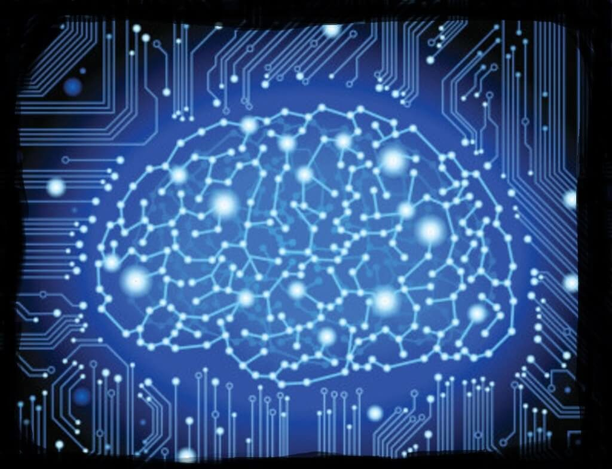

# AI vs Game AI

<
>Test<
>

Artificial Intelligence is a broad field on its own. As you start to work on an AI project it gets highly technical and specialized very quickly. That is why there are many AI applications using variety of algorithms to solve problems. Through my experience I found out that problem dictates the algorithm heavily. As such while most of the algorithms fall into one category or another their approaches are often so distinct that learning one type of AI does not necessarily train you in another.

I took an AI course when I was an undergrad in Bilkent University. The course was not games specific. However I was able to see difference of perspectives between real world AI and games AI. When we look at the usage of AI in games, while there are still variety of algorithms out there, the problems they tackle are bounded in the field of games. That is why I find it easier to understanding the relations between different approaches. However we were able to study applications on games, it was very limited though. While the algorithms used in games are the same there are couple of differences in mentality.

Any self-respecting programmer writing an algorithm out there cares about performance. Many AI algorithms are fine tuned to solve their respected problems as fast as possible. This often results in algorithms that can solve one problem in a one very specific way. There is also issue of optimality or exactness in AI. When you are writing an AI to be used in the field, you want it to find the most correct answer. That one answer that makes people say “Damn… I am glad I have an trusty AI to calculate that!”.

In games however **performance is god**. You don’t aim for it, you worship it. You need to run your AI in an environment where user inputs are reflected to a physics simulation, which outputs its result to a rendering pipeline that delivers 60 frames of high resolution pixels per second. This means cutting out optimal or exact solutions where necessary. We don’t need a completely realistic bird brain, we need thousands of birds flying around that looks satisfying enough to make our game look good. This is a very obvious but important shift of mentality. While real world applications settle for suboptimal solutions where necessary, game AI does that almost all the time.

Another point against exactness is that it is not always gratifying to **play against a perfect opponent**. Players want challenge for sure. But they want an achievable one. In game design there is a concept called **flow**. For players to be engaged in a game there needs to be a good balance between their skill level and challenge presented by game. If game is too easy they get bored. If it is too hard they simply give up on playing. So you should not make the perfect AI or an easy one. You need just the right amount. And if possible something that can be adjusted for individual player. **Game AI is often intentionally flawed**.

# Categorization of Game AI

I won’t be making any claims here. I am neither experienced enough nor well researched on the topic to accurately make a categorization. So I will be standing on the shoulders of giants. There is a research paper identifying key areas of games AI based on the surveys and workshops made at Dagstuhl Seminar – Artificial and Computational Intelligence in Games 2012[^1]. These key areas are as follows:

* **Non-player character (NPC) behavior learning:** This field is an area of machine learning. You design an NPC AI to replicate a behaviour via learning from data collected from the real thing.
* **Search and planning:** This type of AI is used to search state space to find desired solution. Sounds mouthful though concept is rather simple. Imagine you are making a tic-tac-toe AI. You create a model that can support both current and all other possible game states. An algorithm tries to find the correct series moves that will end up in a desired win state and that is your plan. Even though the concept is simple things get complicated when you try to find the best plan with high performance. I am rather focused on this area so I will share more detailed examples in the future.
 * **Player modeling:** This is actually very hot topic in mobile free-to-play games. You try to model player’s personal experience of the game via collecting information on the interactions they make during the game session. You can than try to find the causal links between series of actions and their results. Many data driven games collect usage data to make these analysis. But there are some out there that take the step further to create AI systems that can learn from data and take action. An example is detecting player type and customizing experience of that player. Finding out potential paying users via Early Whale Detection algorithms so you can focus on their experience in your design.
 * **Games as AI benchmarks:** AI people need to battle it out from time to time. There are specially designed games that enable AI developers to test their algorithms against others. These benchmark games provide important data on how each approach works on different test cases.
 * **Procedural content generation:** There are many ways to procedurally generating content. Some involve simple algorithms that don’t require any form of intelligent decision making at all. But more often than not you will need to generate and evaluate your procedural content. Sometimes you can test a procedurally generated level with an AI to see if level fits your gameplay requirements. Other times the generation method itself should be intelligent.
 * **Computational narrative:** This area focuses on creating narratives via computer algorithms. For instance you can use a variation of search and planning algorithm to generate a planned narrative. Alternatively you can focus on creating NPC agent behaviors capable of creating a story on the fly as emergent narratives. This is another area I am interested in and will work on in the future.
 * **Believable agents:** Believability of an AI is an important topic as I mentioned before. This field is more focused on replicating human-like behaviors, with emotions, mistakes and all that.
 * **AI-assisted game design:** Power of AI can be harnessed not only in runtime but during game design itself. These kind of AI agents are usually embedded in authoring tools of game designers to provide support during the game production.
 * **General game AI:** As I mentioned before AI in practice is rather diverse and specific at the same time. Each problem has a different solution. General game AI focuses on doing the opposite, creating AI algorithms that can play any game given the correct configurations.
 * **AI in commercial games:** Distinction between academia and developers is quite simple. Academics want to invent new breakthroughs, developers want things to simply work without complication. While they inspire each other they are often very disjointed at the same time.
 
 [1] A Panorama of Artificial and Computational Intelligence in Games
