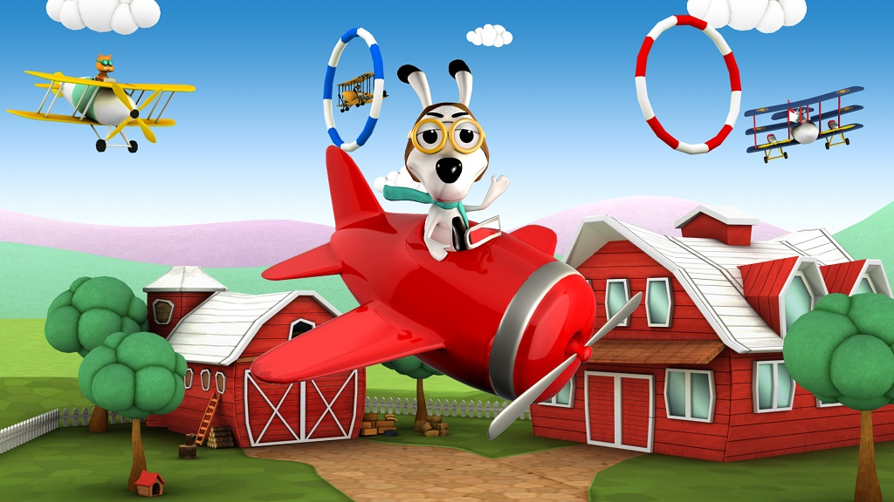

# Pets & Planes Arcade Racing Game

Pets & Planes is an arcade racing game for mobile devices. The game has colorful family friendly graphics but intended for all audiences. We have developed this project while I was working at Yeti Interactive. We have self-funded the project to experiment. Our main purpose was to test our ideas about workings of the mobile games market.  I mainly worked on designing and programming game’s meta features; monetization funnel as well as the social integrations. The game had a limited local success in Turkey, but the experience I gained on ad networks have been invaluable. Memories of me tackling Facebook’s crazy open graph requirements still haunt me today, in a good way.

iOs: [App Store](https://itunes.apple.com/tr/app/pets-planes/id892324286)

Android: [Play Store Page](https://play.google.com/store/apps/details?id=net.yetiinteractive.PetsPlanes)
