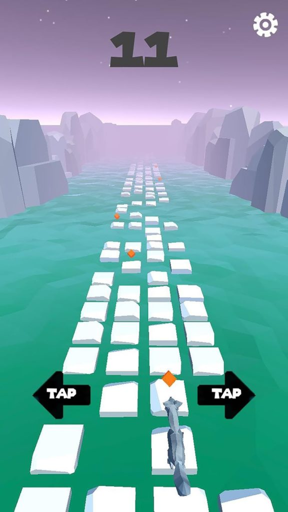

# Infinite Runner Game

::: div relative
 ::: div sidebar
  
 :::
:::

Sillywalk Games wanted to produce a runner title for a hyper casual mobile game market. Runner Fox is an endless running game, in which challenges player’s reflexes with accelerating difficulty.

I worked with Sillywalk Games as a freelancer before in reproduction of Mind Mould 2. Stars were aligned when I moved to Canada, the studio had already been relocated to Canada. This time I worked there as full-time employee to develop Runner Fox. I developped the game fully within a month along with its ad-network and analytics integration. This was the first project I implemented an ad mediation waterfall to optimize ad revenue.

iOs: [App Store](https://itunes.apple.com/us/app/runner-fox/id1375819744)

Android: [Play Store Page](https://play.google.com/store/apps/details?id=com.sillywalk.ttr)
