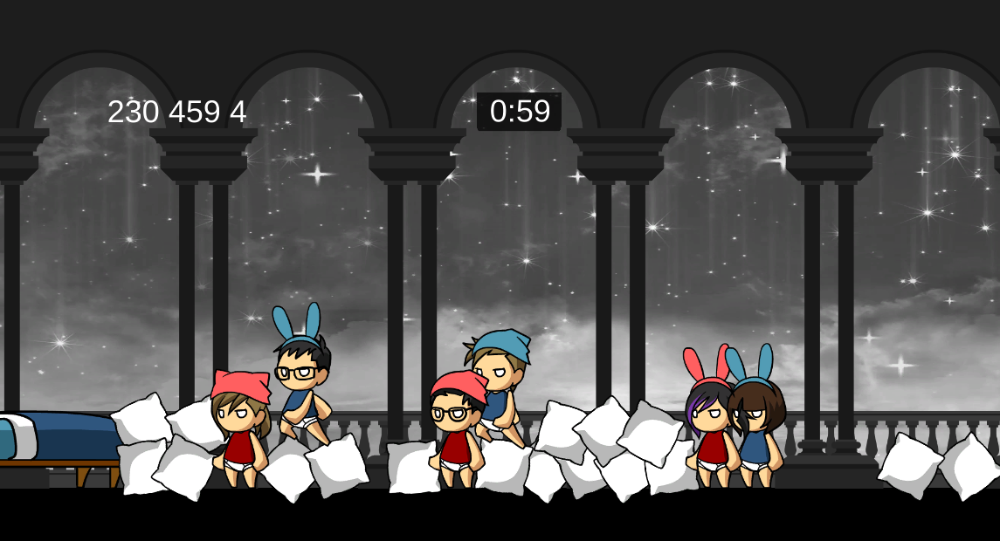

# Hot Seat Fighting Game for Global Game Jam 

In 2019 Global Game Jam, we wanted to work on a project inspired by game jam diversifiers. Two diversifiers stood out to us: Always Room for One More (players can join in at any time), Party Maker (played on a single screen using smartphones as controller). With these diversifiers in mind, and many hours of playing Smash Bro’s in the office, we made Slumble.

Slumble (inspired by Slumber Rumble) is a team brawler pillow fight game where each team tries to collect as many pillows as possible on their bed for their pillow fortress. At the same time, they fight off other team members trying to steal their pillows or do the same to them.

The game was really fun as a prototype. However, we did not turn it into a product to put on Air Console platform, so it is sadly unplayable.