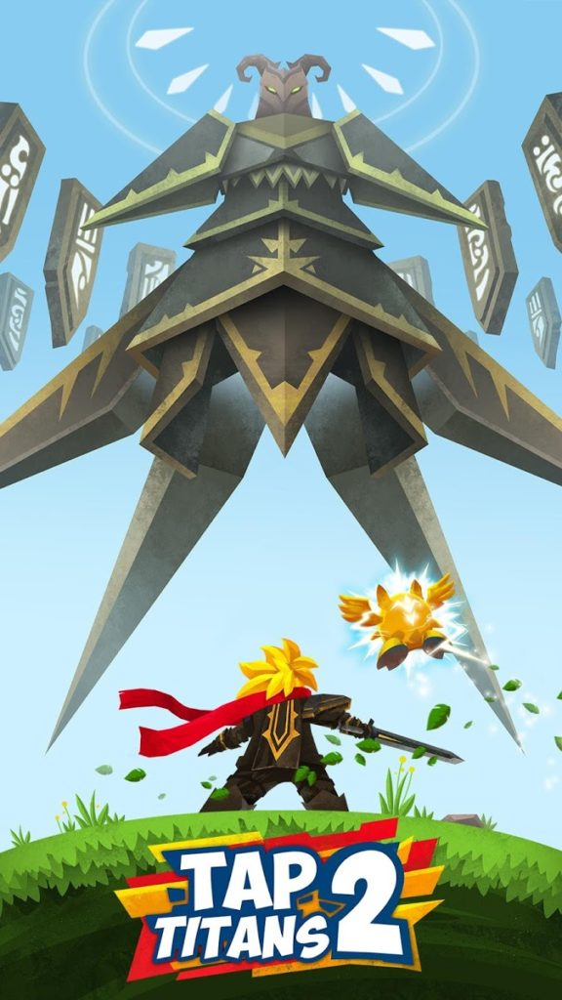

# Mobile Incremental Game

::: div relative
 ::: div sidebar
  
 :::
:::

Tap Titans is the incremental game franchise that popularized the genre in mobile stores. I joined the development of Tap Titans 2 team before its 3.0 release to develop new features. While I worked at Game Hive, I also brought some of my prior experience to the table introducing runtime patching using reflection libraries to improve testing processes. We have used these patching methods to eliminate need for introducing temporary code to main codebase to test server endpoints.

I have also took initiative to profile performance of the game. Reduced the memory impact of new features to eliminate crashes on low end devices. Also found causes of CPU spikes in older code, which improved the game’s framerate during heavy calculations.

iOs: [App Store](https://itunes.apple.com/us/app/tap-titans-2/id1120294802)

Android: [Play Store Page](https://play.google.com/store/apps/details?id=com.gamehivecorp.taptitans2)
